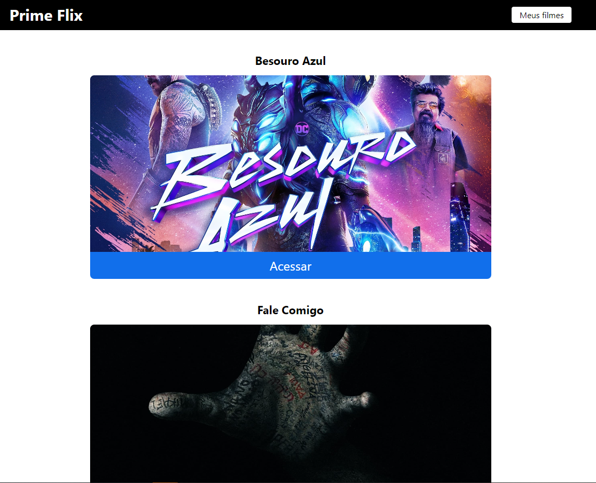

# Filmaria com ReactJS

Este é um projeto de filmes desenvolvido com ReactJS e Typescript. Ele permite listar filmes na tela consumindo a API do The Movie DB, adicionar filmes e remover filmes da lista de favoritos.

## Funcionalidades

- Listagem de filmes: exibe uma lista de filmes obtidos da API do The Movie DB.
- Adição de filmes à lista de favoritos: permite adicionar filmes à lista de favoritos.
- Remoção de filmes da lista de favoritos: possibilita remover filmes da lista de favoritos.

## Tecnologias utilizadas

- ReactJS: biblioteca JavaScript para construção de interfaces de usuário.
- HTML5: linguagem de marcação para estruturar o conteúdo da aplicação.
- CSS3 e Sass: linguagem de estilo para estilizar a interface do usuário.
- API do The Movie DB: utilizada para obter dados dos produtos.

## Link da aplicação

https://primeflix-psi.vercel.app/
