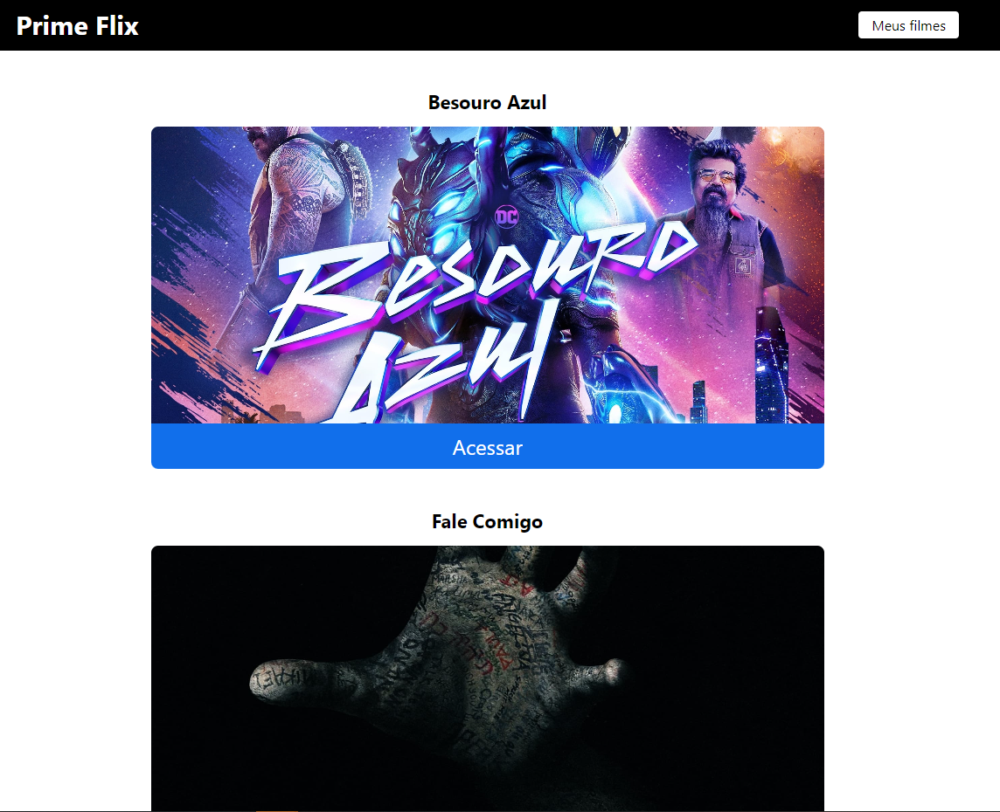
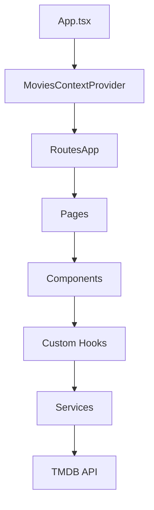

# 🎬 Prime Flix

> Uma aplicação moderna de catálogo de filmes desenvolvida com React e TypeScript, consumindo a API do The Movie Database (TMDB).



## 📋 Índice

- [Sobre o Projeto](#sobre-o-projeto)
- [Funcionalidades](#funcionalidades)
- [Tecnologias](#tecnologias)
- [Arquitetura](#arquitetura)
- [Instalação](#instalação)
- [Como Usar](#como-usar)
- [Estrutura do Projeto](#estrutura-do-projeto)
- [API](#api)
- [Deploy](#deploy)
- [Contribuição](#contribuição)
- [Licença](#licença)

## 🎯 Sobre o Projeto

O **Prime Flix** é uma Single Page Application (SPA) que funciona como um catálogo completo de filmes. A aplicação permite aos usuários explorar filmes por diferentes categorias, visualizar detalhes completos, gerenciar uma lista de favoritos e buscar por títulos específicos.

### 🎨 Características Principais

- **Interface Moderna**: Design responsivo e intuitivo
- **Performance Otimizada**: Cache inteligente e lazy loading
- **TypeScript**: Type safety em todo o projeto
- **PWA Ready**: Preparado para Progressive Web App

## ✨ Funcionalidades

### 🎬 Catálogo de Filmes
- **Em Exibição**: Filmes atualmente em cartaz
- **Populares**: Filmes mais populares do momento
- **Mais Votados**: Filmes com melhor avaliação
- **Em Breve**: Próximos lançamentos

### 🔍 Busca e Navegação
- **Busca Inteligente**: Pesquisa por título de filmes
- **Detalhes Completos**: Informações detalhadas de cada filme
- **Elenco e Equipe**: Visualização de atores e diretores
- **Trailers**: Reprodução de vídeos promocionais

### ❤️ Sistema de Favoritos
- **Lista Personalizada**: Salve seus filmes favoritos
- **Armazenamento Local**: Dados persistidos no navegador
- **Gerenciamento Completo**: Adicionar e remover facilmente

### 📱 Design Responsivo
- **Mobile First**: Otimizado para dispositivos móveis
- **Menu Adaptativo**: Navegação intuitiva em todas as telas
- **Performance**: Carregamento rápido em qualquer dispositivo

## 🛠 Tecnologias

### Frontend
- **React 18.2.0** - Biblioteca principal
- **TypeScript 5.4.3** - Tipagem estática
- **React Router DOM 6.10.0** - Roteamento
- **SASS 1.60.0** - Pré-processador CSS

### HTTP & Estado
- **Axios 1.3.4** - Cliente HTTP
- **Context API** - Gerenciamento de estado global
- **Custom Hooks** - Lógica reutilizável

### UI/UX
- **React Icons 5.0.1** - Ícones
- **React Toastify 9.1.2** - Notificações
- **React Spinners 0.13.8** - Loading states

### Desenvolvimento
- **ESLint** - Linting
- **Prettier** - Formatação de código
- **Netlify CLI** - Deploy

## 🏗 Arquitetura

### Padrões Utilizados

#### 🎯 Context API Pattern
```typescript
// Gerenciamento de estado global sem Redux
const MoviesContext = createContext<MoviesContextType>()
```

#### 🪝 Custom Hooks Pattern
```typescript
// Lógica reutilizável encapsulada
const useMovie = () => { /* lógica específica */ }
```

#### 🔧 Service Layer Pattern
```typescript
// Separação clara entre lógica de negócio e apresentação
const getMovies = async (endpoint) => { /* API calls */ }
```

### Fluxo de Dados


```mermaid
graph TD
    A[App.tsx] --> B[MoviesContextProvider]
    B --> C[RoutesApp]
    C --> D[Pages]
    D --> E[Components]
    E --> F[Custom Hooks]
    F --> G[Services]
    G --> H[TMDB API]
```

## 🚀 Instalação

### Pré-requisitos
- Node.js (versão 16 ou superior)
- npm ou yarn
- Chave da API do TMDB

### Passos

1. **Clone o repositório**
```bash
git clone https://github.com/seu-usuario/prime-flix.git
cd prime-flix
```

2. **Instale as dependências**
```bash
npm install
# ou
yarn install
```

3. **Configure a API**
```bash
# Crie um arquivo .env na raiz do projeto
echo "REACT_APP_TMDB_API_KEY=sua_chave_aqui" > .env
```

4. **Execute o projeto**
```bash
npm start
# ou
yarn start
```

5. **Acesse a aplicação**
```
http://localhost:3000
```

## 📖 Como Usar

### 🎬 Explorando Filmes
1. **Navegue pelas categorias** no menu principal
2. **Clique em um filme** para ver detalhes completos
3. **Explore o elenco** clicando nos nomes dos atores
4. **Assista aos trailers** disponíveis

### ❤️ Gerenciando Favoritos
1. **Adicione filmes** clicando no botão "Salvar"
2. **Visualize sua lista** na página "Favoritos"
3. **Remova filmes** conforme necessário

### 🔍 Buscando Filmes
1. **Use a barra de busca** no cabeçalho
2. **Digite o nome** do filme desejado
3. **Explore os resultados** encontrados

## 📁 Estrutura do Projeto

```
src/
├── components/          # Componentes reutilizáveis
│   ├── Button/         # Botão customizado
│   ├── Header/         # Cabeçalho da aplicação
│   ├── Footer/         # Rodapé
│   ├── Movie/          # Componentes relacionados a filmes
│   └── ...
├── pages/              # Páginas da aplicação
│   ├── MoviesContainer/ # Container principal
│   ├── Movie/          # Página de detalhes
│   ├── Favorites/      # Página de favoritos
│   └── ...
├── contexts/           # Contextos React
│   ├── MoviesContext.tsx
│   └── menuContext.tsx
├── hooks/              # Hooks customizados
│   ├── useMovie.js
│   ├── useSearch.js
│   └── ...
├── services/           # Camada de serviços
│   ├── api.js
│   ├── getMovies.js
│   └── ...
├── interfaces/         # Definições TypeScript
│   ├── movie.ts
│   ├── person.ts
│   └── ...
├── constants/          # Constantes da aplicação
│   ├── api.js
│   ├── routes.js
│   └── ...
├── utils/              # Utilitários
│   ├── formatCurrency.js
│   ├── formateDate.js
│   └── ...
└── styles/             # Estilos globais
    ├── App.scss
    └── index.scss
```

## 🔌 API

### The Movie Database (TMDB)
A aplicação consome a API do TMDB para obter dados dos filmes:

- **Base URL**: `https://api.themoviedb.org/3/`
- **Imagens**: `https://image.tmdb.org/t/p/original/`
- **Documentação**: [TMDB API Docs](https://developers.themoviedb.org/3)

### Endpoints Utilizados
- `GET /movie/now_playing` - Filmes em exibição
- `GET /movie/popular` - Filmes populares
- `GET /movie/top_rated` - Filmes mais votados
- `GET /movie/upcoming` - Próximos lançamentos
- `GET /movie/{id}` - Detalhes do filme
- `GET /movie/{id}/credits` - Elenco do filme
- `GET /person/{id}` - Detalhes da pessoa

## 🚀 Deploy

### Netlify (Recomendado)
```bash
# Build do projeto
npm run build

# Deploy via Netlify CLI
netlify deploy --prod --dir=build
```

### Vercel
```bash
# Deploy automático via Vercel CLI
vercel --prod
```

### Variáveis de Ambiente
Certifique-se de configurar as seguintes variáveis no seu provedor de deploy:
- `REACT_APP_TMDB_API_KEY` - Sua chave da API do TMDB

## 🤝 Contribuição

Contribuições são sempre bem-vindas! Para contribuir:

1. **Fork o projeto**
2. **Crie uma branch** para sua feature (`git checkout -b feature/AmazingFeature`)
3. **Commit suas mudanças** (`git commit -m 'Add some AmazingFeature'`)
4. **Push para a branch** (`git push origin feature/AmazingFeature`)
5. **Abra um Pull Request**

### Padrões de Código
- Use TypeScript para novos arquivos
- Siga as convenções de nomenclatura do projeto
- Adicione testes para novas funcionalidades
- Mantenha a documentação atualizada

## 📄 Licença

Este projeto está sob a licença MIT. Veja o arquivo [LICENSE](LICENSE) para mais detalhes.

## 🔗 Links Úteis

- **Aplicação**: [https://primeflix-psi.vercel.app/](https://primeflix-psi.vercel.app/)
- **API TMDB**: [https://www.themoviedb.org/documentation/api](https://www.themoviedb.org/documentation/api)
- **React Docs**: [https://reactjs.org/docs](https://reactjs.org/docs)
- **TypeScript Docs**: [https://www.typescriptlang.org/docs](https://www.typescriptlang.org/docs)

---

<div align="center">
  <p>Desenvolvido com ❤️ usando React e TypeScript</p>
  <p>⭐ Se este projeto te ajudou, considere dar uma estrela!</p>
</div>
